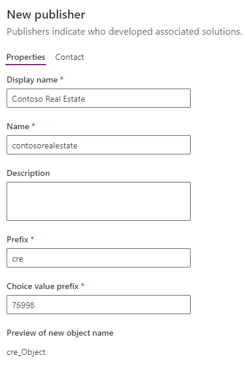

---
lab:
  title: 'ラボ 1:発行元とソリューション'
  module: 'Module 1: Create tables in Dataverse'
---

# 実習ラボ 1: 発行元とソリューション

## シナリオ

このラボでは、発行元とソリューションを作成します。

## 学習する内容

- Microsoft Dataverse でソリューションを作成する方法
- 既存のコンポーネントをソリューションに追加する方法

## ラボ手順の概要

- 発行元の作成
-  ソリューションを作成する
- テーブル、列、ビュー、フォームをソリューションに追加する
  
## 前提条件

- 以下を完了している必要があります: 「**ラボ 0: ラボ環境を検証する**」

## 詳細な手順

## 演習 1: 発行元とソリューションを作成する

この演習では、Power Apps Maker ポータルの開発環境にアクセスし、新しいソリューションを作成します。

### タスク 1.1 – Maker ポータル

1. 新しいタブで、Power Apps Maker ポータル `https://make.powerapps.com` に移動し、もう一度メッセージが表示されたら、Microsoft 365 資格情報でサインインします。

1. **電話番号**の入力を求められたら、`0123456789` を入力し、**[送信]** を選択します。

1. 画面の右上隅にある環境セレクターを使用して環境を切り替えます。

1. リストから **[Dev One]** 環境を選びます。

    ![Power Apps Maker ポータルで [開発環境] を選択します。](../media/select-dev-one-environment.png)

1. 左側のナビゲーション ペインから **[アプリ]** を選択し、**[すべて]** を選択します。 Dataverse Accelerator App、Solution Health Hub、Power Pages Management など、いくつかのアプリが一覧表示されます。

1. 左側のナビゲーション ペインから **[テーブル]** を選択します。 アカウントや連絡先を含む *[共通データ モデル]* の標準テーブルが表示されます。

### タスク 1.2: ソリューションと発行元を作成する

1. 左側のナビゲーション ウィンドウから**ソリューション**を選択します。 *[既定のソリューション]* や *[[共通データ モデルの既定のソリューション]* など、いくつかのソリューションが表示されます。

    

1. **+ 新しいソリューション**を選択します。

1. **[表示名]** テキスト ボックスに、「**`Property listings`**」と入力します。

1. **[名前]** が自動的に設定されていることを確認します。

1. **[発行元]** ドロップダウンの下にある **[+ 新しい発行元]** を選択します。

1. **[表示名]** に、`Contoso Real Estate` を入力します

1. **[名前]** に「`contosorealestate`」と入力します。

1. **[プレフィックス]** に「`cre`」と入力します。

    

1. **[保存]** を選択します。

1. **[発行元]** ドロップダウンで、**[Contoso Real Estate (contosorealestate)]** を選択します。

1. **［作成］** を選択します

    

## 演習 2 - ソリューションにコンポーネントを追加する

この演習では、ソリューションに既存のテーブルを追加します。

### タスク 2.1 – テーブルを追加する

1. Power Apps Maker ポータル `https://make.powerapps.com` に移動します

1. **Dev One** 環境にいることを確認します。

1. **ソリューション**を選択します。

1. 前の演習の **Contoso Real Estate** ソリューションを選択します。

    

1. **[既存の追加]**、**[テーブル]** の順に選択します。

    

1. **取引先企業**テーブルを選択します。

    

1. [**次へ**] を選択します。

1. **[アカウント]** テーブルで、**[オブジェクトの選択]** リンクを選択します。

1. **[列]** タブで、**[アカウント番号]** 列を選択します。

1. **ビュー** タブを選択します。

1. **アクティブな取引先企業**ビューを選択します。

1. **フォーム** タブを選択します。

1. **Account** フォームを選択します。

1. **[追加]** を選択します。

    > **注:**  **Account** テーブルでは、1 つのビュー、1 つのフォーム、1 つの列が選択されています。

    

1. **[追加]** を選択します。
