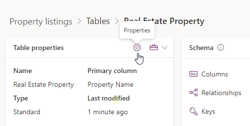

---
lab:
  title: 'ラボ 2:データ モデル'
  module: 'Module 1: Create tables in Dataverse'
---

# 実習ラボ 2 - データ モデル

## シナリオ

このラボでは、Dataverse テーブル、列、リレーションシップを作成します。

Contoso Real Estate は、以下の 2 つの重要な要素を追跡したいと考えています。

- 不動産物件一覧
- 不動産物件の内覧予定者

## 学習する内容

- Dataverse でテーブルを作成する方法
- Dataverse テーブルに列を追加する方法
- テーブル間にリレーションシップを作成する方法

## ラボ手順の概要

- テーブルの作成
- 列を作成する
- リレーションシップの作成
  
## 前提条件

- 完了している必要があるもの: 「**ラボ 1: 発行者とソリューション**」

## 詳細な手順

## 演習 1 - テーブルを作成する

この演習では、テーブルを作成してソリューションに追加します。

### タスク 1.1 – Real Estate Property テーブルを作成する

1. Power Apps 作成者ポータル (`https://make.powerapps.com`) に移動します

1. **Dev One** 環境にいることを確認します。

1. **ソリューション**を選択します。

1. **[物件一覧]** ソリューションを開きます。

1. **[+ 新規]** を選択した後、**[テーブル]** を選択し、もう一度 **[テーブル]** を選択します。

    ![[新しいテーブル] ペインのスクリーンショット](../media/new-table-pane.png)

1. **[表示名]** に `Real Estate Property` を入力します。 複数形の名前が自動的に設定されます。

1. **プライマリ列**タブを選択します。

1. **[表示名]** に `Property Name` を入力します。

1. **[詳細オプション]** を展開し、使用可能なオプションを確認しますが、ここでは何も変更しません。

    ![[テーブルのプライマリ列] タブのスクリーンショット](../media/primary-column-tab.png)

1. **[プロパティ]** タブを選択します。

1. **詳細オプション**を展開します。

1. **[新しいアクティビティの作成]** にチェックを入れます。

1. **[検索結果に表示]** にチェックを入れます。

    ![[テーブルの詳細オプション] のスクリーンショット](../media/table-options.png)

1. **[保存]** を選択します。

### タスク 1.2 – Showing テーブルを作成する

1. **[オブジェクト]** ペインで、**[すべて]** を選択します。

1. **[+ 新規]** を選択した後、**[テーブル]** を選択し、もう一度 **[テーブル]** を選択します。

1. **[表示名]** に `Showing` を入力します。 複数形の名前が自動的に設定されます。

1. **詳細オプション**を展開します。

1. **[検索結果に表示]** にチェックを入れます。

1. **[保存]** を選択します。

### タスク 1.3 – Open House テーブルを作成する

1. **[オブジェクト]** ペインで、**[すべて]** を選択します。

1. **[+ 新規]** を選択した後、**[テーブル]** を選択し、もう一度 **[テーブル]** を選択します。

1. **[表示名]** に `Open House` を入力します。 複数形の名前が自動的に設定されます。

1. **詳細オプション**を展開します。

1. **[レコードの所有権]** で **[組織]** を選択します。

1. **[保存]** を選択します。

### タスク 1.4 – contact テーブルを追加する

1. **[オブジェクト]** ペインで、**[すべて]** を選択します。

1. **[既存を追加]** を選択して **[テーブル]** を選択します。

1. **取引先担当者** テーブルを選択します。

1. [**次へ**] を選択します。

1. **[追加]** を選択します。

## 演習 2 - 列を作成する

この演習では、ソリューションのテーブルに列を作成します。

### タスク 2.1 – Real Estate Property 列を作成する

1. Power Apps 作成者ポータル (`https://make.powerapps.com`) に移動します

1. **Dev One** 環境にいることを確認します。

1. **ソリューション**を選択します。

1. **[物件一覧]** ソリューションを開きます。

1. **Real Estate Property** テーブルを選択します。

1. **[プロパティ]** を選択します。

    

1. **[添付ファイルを有効にする]** にチェックを入れて、**[保存]** を選択します。

1. **スキーマ** の下で、**列** を選択します。

1. **+ 新しい列**を選択します。

    ![[新しい列] ペインのスクリーンショット](../media/new-column-pane.png)

1. **[表示名]** に `Asking Price` を入力します。

1. **[データ型]** ドロップダウンで **[通貨]** を選択します。

1. **[必須]** ドロップダウンで、**[Business が必須]** を選択します。

1. **[保存]** を選択します。

1. **[+ 新しい列]** を選択します。

1. **[表示名]** に `Street` を入力します。

1. **[必須]** ドロップダウンで、**[Business が必須]** を選択します。

1. **[保存]** を選択します。

1. **[+ 新しい列]** を選択します。

1. **[表示名]** に `City` を入力します。

1. **[必須]** ドロップダウンで、**[Business が必須]** を選択します。

1. **[保存]** を選択します。

1. **[+ 新しい列]** を選択します。

1. **[表示名]** に `Bedrooms` を入力します。

1. **[データ型]** ドロップダウンで **[選択肢]** を選択し、もう一度 **[選択肢]** を選択します。

    ![[新しい選択肢列] ペインのスクリーンショット](../media/add-choice.png)

1. **[グローバル選択肢と同期]** で **[はい]** を選択します。

1. **[+ 新しい選択肢]** を選択します。

    ![[新しいグローバル選択肢] ペインのスクリーンショット](../media/new-global-choice.png)

1. **[表示名]** に `Number of Rooms` を入力します。

1. **[ラベル]** に `1` を、**[値]** に `1` を入力します。

1. **[+ 新しい選択肢]** を選択し、**[ラベル]** に `2` を、**[値]** に `2` を入力します。

1. **[+ 新しい選択肢]** を選択し、**[ラベル]** に `3` を、**[値]** に `3` を入力します。

1. **[+ 新しい選択肢]** を選択し、**[ラベル]** に `4` を、**[値]** に `4` を入力します。

1. **[+ 新しい選択肢]** を選択し、**[ラベル]** に `5` を、**[値]** に `5` を入力します。

    ![完成した [グローバル選択肢] ペインのスクリーンショット](../media/global-choice.png)

1. **[保存]** を選択します。

1. **[この選択肢の同期対象]** で **[部屋の数]** を選択します。

1. **[保存]** を選択します。

1. **[+ 新しい列]** を選択します。

1. **[表示名]** に `Bathrooms` を入力します。

1. **[データ型]** ドロップダウンで **[選択肢]** を選択し、もう一度 **[選択肢]** を選択します。

1. **[この選択肢の同期対象]** で **[部屋の数]** を選択します。

1. **[保存]** を選択します。

### タスク 2.2 – Showing 列を作成する

1. **[オブジェクト]** ペインで、**[すべて]** を選択します。

1. **Showing** テーブルを選択します。

1. **スキーマ** の下で、**列** を選択します。

1. **[+ 新しい列]** を選択します。

1. **[表示名]** に `Showing Date` を入力します。

1. **[データ型]** ドロップダウンで **[日付と時刻]** を選択します。

1. **[書式]** ドロップダウンで **[日付のみ]** を選択します。

1. **[必須]** ドロップダウンで、**[Business が必須]** を選択します。

1. **[保存]** を選択します。

1. **[+ 新しい列]** を選択します。

1. **[表示名]** に `Comments` を入力します。

1. **[データ型]** ドロップダウンで **[テキスト]** を選択した後、**[複数行のテキスト]** で **[プレーン テキスト]** を選択します。

1. **[保存]** を選択します。

1. **[表示名]** に `Level of Interest` を入力します。

1. **[データ型]** ドロップダウンで **[選択肢]** を選択し、もう一度 **[選択肢]** を選択します。

1. **[グローバル選択肢と同期]** で **[いいえ]** を選択します。

1. **[ラベル]** に「`Very High`」と入力します。

1. **[+ 新しい選択肢]** を選択し、**[ラベル]** に `High` を入力します。

1. **[+ 新しい選択肢]** を選択し、**[ラベル]** に `Medium` を入力します。

1. **[+ 新しい選択肢]** を選択し、**[ラベル]** に `Low` を入力します。

1. **[+ 新しい選択肢]** を選択し、**[ラベル]** に `No interest` を入力します。

1. **[保存]** を選択します。

1. **[+ 新しい列]** を選択します。

1. **[表示名]** に `Shown by` を入力します。

1. **[データ型]** ドロップダウンで **[参照]** を選択し、もう一度 **[参照]** を選択します。

1. **[関連するテーブル]** ドロップダウンで、**[ユーザー]** を選択します。

1. **[保存]** を選択します。

### タスク 2.3 – Open House 列を作成する

1. **[オブジェクト]** ペインで、**[すべて]** を選択します。

1. **Open House** テーブルを選択します。

1. **スキーマ** の下で、**列** を選択します。

1. **[+ 新しい列]** を選択します。

1. **[表示名]** に `Open House Date` を入力します。

1. **[データ型]** ドロップダウンで **[日付と時刻]** を選択します。

1. **[書式]** ドロップダウンで **[日付のみ]** を選択します。

1. **[必須]** ドロップダウンで、**[Business が必須]** を選択します。

1. **[保存]** を選択します。

## 演習 3 - リレーションシップを作成する

この演習では、テーブルとソリューションの間にリレーションシップを作成します。

### タスク 3.1 – Real Estate Property から Contact へのリレーションシップ

1. Power Apps 作成者ポータル (`https://make.powerapps.com`) に移動します

1. **Dev One** 環境にいることを確認します。

1. **ソリューション**を選択します。

1. **[物件一覧]** ソリューションを開きます。

1. **Real Estate Property** テーブルを選択します。

1. **[スキーマ]** で、**[リレーションシップ]** を選択します。

1. **[+ 新しいリレーションシップ]** を選択した後、**[多対一]** を選択します。

1. **[関連する (1 つの) テーブル]** ドロップダウンで **[Contact]** を選択します。

1. **[参照列の表示名]** に `Client` を入力します。

1. **[参照列の要件]** ドロップダウンで、**[Business が必須]** を選択します。

1. **完了** を選択します。

### タスク 3.2 – Real Estate Property から Showing へのリレーションシップ

1. **[+ 新しいリレーションシップ]** を選択した後、**[一対多]** を選択します。

1. **[関連する (多数の) テーブル]** ドロップダウンで **[Showing]** を選択します。

1. **[参照列の要件]** ドロップダウンで、**[Business が必須]** を選択します。

1. **完了** を選択します。

### タスク 3.3 – Real Estate Property から Open House へのリレーションシップ

1. **[+ 新しいリレーションシップ]** を選択した後、**[一対多]** を選択します。

1. **[関連する (多数の) テーブル]** ドロップダウンで **[Open House]** を選択します。

1. **[参照列の要件]** ドロップダウンで、**[Business が必須]** を選択します。

1. **[全般]** を展開します。

1. **[リレーションシップ名]** に「`realestateproperty_openhouse`」と入力します。

1. **完了** を選択します。

### タスク 3.4 – Showing から Contact へのリレーションシップ

1. **[オブジェクト]** ペインで、**[すべて]** を選択します。

1. **Showing** テーブルを選択します。

1. **[スキーマ]** で、**[リレーションシップ]** を選択します。

1. **[+ 新しいリレーションシップ]** を選択した後、**[多対一]** を選択します。

1. **[関連する (1 つの) テーブル]** ドロップダウンで **[Contact]** を選択します。

1. **[参照列の表示名]** に `Shown to` を入力します。

1. **完了** を選択します。

