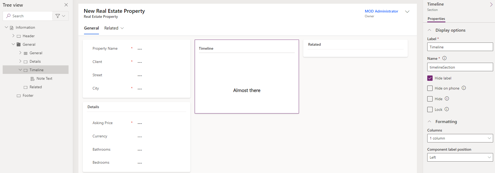

---
lab:
  title: 'ラボ 4:フォームとビューを構成する'
  module: 'Module 3: Configure forms, charts, and dashboards in model-driven apps'
---

# 実習ラボ 4 - フォームとビューを構成する

## シナリオ

このラボでは、モデル駆動型アプリのフォームとビューを構成します。

Contoso Real Estate は次の 2 つの重要な要素を追跡したいと考えています。

- 不動産物件一覧
- 不動産物件の内覧予定者

## 学習する内容

- テーブル フォームを構成する方法
- テーブル ビューを構成する方法

## ラボ手順の概要

- 不動産物件と内覧のメイン フォームを構成する
- タブとセクションを構成する
- フォームに列を追加する
- サブグリッドを追加する
- 新しいフォームを作成する
- フォームにセキュリティ ロールを関連付ける
- 不動産物件と内覧のビューを構成する
- ビューをフィルター処理する
- 簡易検索ビューを構成する
  
## 前提条件

- 以下を完了している必要があります。「**ラボ 2: データ モデル**」

## 詳細な手順

## 演習 1 - 不動産物件のメイン フォーム

この演習では、不動産物件テーブルのメイン フォームを変更します。

### タスク 1.1 – メイン フォームのレイアウトと列

1. Power Apps Maker ポータル `https://make.powerapps.com` に移動します

1. **Dev One** 環境にいることを確認します。

1. **ソリューション**を選択します。

1. **[物件一覧]** ソリューションを開きます。

1. **[不動産物件]** テーブルを選択します。

1. **データ エクスペリエンス**で、**フォーム**を選択します。

1. **[フォームの種類]** が **[メイン]** の **[情報]** フォームを選択し、**[コマンド]** メニュー (...) を選び、**[編集]** > **[新しいタブで編集]** の順に選択します。

1. フォーム デザイナーの左側にある **[ツリー ビュー]** を選択します。

1. **全般**タブを選択します。

1. **[名前]** に「`generalTab`」と入力します。

1. 右側の **[プロパティ]** ペインで、**[レイアウト]** ドロップダウンの **[3 列]** を選択します。

    

1. **[ツリー ビュー]** で、**[全般]** タブを展開します。最初のセクションを選択し、**[名前]** に「`generalSection`」と入力します。

1. 2 番目のセクションを選択し、**[ラベル]** に「`Timeline`」と入力し、**[名前]** に「`timelineSection`」と入力します。

1. 3 番目のセクションを選択し、**[ラベル]** に「`Related`」と入力し、**[名前]** に「`relatedSection`」と入力します。

1. **[所有者]** フィールドを **[ヘッダー]** 領域にドラッグします。

    

1. 最初のセクションを選択します。

1. フォーム デザイナーの左側のナビゲーションから **[テーブル列]** を選択します。

1. **[物件名]** フィールドの下に **[クライアント]** 列をドラッグします。

1. **[番地]** 列を選択して、**[クライアント]** の下のフォームに追加します。

1. **[市区町村]** 列を選択して、**[番地]** の下のフォームに追加します。

1. フォーム デザイナーの左側のナビゲーションから **[コンポーネント]** を選択します。

1. **[1 列セクション]** コントロールを選択して、フォームに追加します。

1. **[ラベル]** に「`Details`」と入力し、**[名前]** に「`detailsSection`」と入力します。

1. フォーム デザイナーの左側のナビゲーションから **[テーブル列]** を選択します。

1. **[希望価格]** 列を選択して、[詳細] セクションに追加します。

1. **[通貨]** 列を選択して、**[希望価格]** の下のフォームに追加します。

1. **[寝室]** 列を選択して、**[通貨]** の下のフォームに追加します。

1. **[浴室]** 列を選択して、**[寝室]** の下のフォームに追加します。

    

### タスク 1.2 – タイムライン コントロールを追加する

1. フォーム デザイナーの左側のナビゲーションから **[ツリー ビュー]** を選択します。

1. **[タイムライン]** セクションを選択します。

1. フォーム デザイナーの左側のナビゲーションから **[コンポーネント]** を選択します。

1. **[表示]** を展開します。

1. **[タイムライン]** コントロールを選択して、**[タイムライン]** セクションに追加します。

1. フォーム デザイナーの左側のナビゲーションから **[ツリー ビュー]** を選択し、**[全般]** タブを展開して、**[タイムライン]** セクションを選びます。

1. 右側の **[プロパティ]** ペインで、**[ラベルの非表示]** チェック ボックスをオンにします。

    

1. **[ツリー ビュー]** で、[タイムライン] の **[メモのテキスト]** コントロールを選択します。

1. 右側の **[プロパティ]** ペインで、**[ソーシャル活動]** を選び、**[有効]** チェック ボックスをオフにして、**[完了]** を選択します。

1. 右側の **[プロパティ]** ペインで、**[活動の並べ替え]** ドロップダウンの **[作成日]** を選択します。

1. フォーム デザイナーの左側のナビゲーションから **[テーブル列]** を選択します。

1. **[状態の理由]** 列を **[ヘッダー]** 領域にドラッグします。

### タスク 1.3 – 簡易表示コントロールを追加する

1. フォーム デザイナーの左側にある **[ツリー ビュー]** を選択します。

1. **[関連]** セクションを選択します。

1. フォーム デザイナーの左側のナビゲーションで **[コンポーネント]** を選択します。

1. **[表示]** を展開します。

1. **[簡易表示]** コントロールを選択して、**[関連]** セクションに追加します。

1. **[検索]** で **[クライアント]** を選び、**[連絡先]** で **[アカウント連絡先カード]** を選んで、**[完了]** を選択します。

### タスク 1.4 – タブを追加する

1. フォーム デザイナーの左側のナビゲーションで **[コンポーネント]** を選択します。

1. **[1 列タブ]** コントロールを選択して、フォームに追加します。

1. **[ラベル]** に「`Showings`」と入力し、**[ラベル]** に「`showingTab`」と入力します。

1. フォーム デザイナーの左側の **[ツリー ビュー]** を選択し、**[内覧]** タブを展開して、**[新しいセクション]** セクションを選びます。

1. **[ラベル]** に「`Showings`」と入力し、**[名前]** に「`showingSection`」と入力します。

1. フォーム デザイナーの左側のナビゲーションで **[コンポーネント]** を選択します。

1. **[グリッド]** を展開します。

1. **[サブグリッド]** コントロールを選択して、**[内覧]** セクションに追加します。

1. **[関連レコードの表示]** を選択します。

1. **[テーブル]** で **[内覧]** を選び、**[既定のビュー]** で **[アクティブな内覧]** を選んで、**[完了]** を選択します。

1. **[ラベル]** に「`Showings`」と入力し、**[名前]** に「`showingsSG`」と入力します。

1. **[ラベルの非表示]** を選択します。

1. **保存と公開**を選択します。

1. フォーム デザイナーを**閉じます**。

1. **完了** を選択します。

## 演習 2 - 内覧のメイン フォーム

この演習では、内覧テーブルのメイン フォームを変更します。

### タスク 2.1 – メイン フォームのレイアウトと列

1. Power Apps Maker ポータル `https://make.powerapps.com` に移動します

1. **Dev One** 環境にいることを確認します。

1. **ソリューション**を選択します。

1. **[物件一覧]** ソリューションを開きます。

1. **[内覧]** テーブルを選択します。

1. **データ エクスペリエンス**で、**フォーム**を選択します。

1. **[フォームの種類]** が **[メイン]** の **[情報]** フォームを選択し、**[コマンド]** メニュー (...) を選び、**[編集]** > **[新しいタブで編集]** の順に選択します。

1. **[所有者]** フィールドを **[ヘッダー]** 領域にドラッグします。

1. フォーム デザイナーの左側のナビゲーションから **[テーブル列]** を選択します。

1. **[不動産物件]** 列を **[名前]** フィールドの下にドラッグします。

1. **[表示先]** 列を選択して、**[不動産物件]** の下のフォームに追加します。

1. **[表示元]** 列を選択して、**[表示先]** の下のフォームに追加します。

1. **[内覧日]** 列を選択して、**[表示元]** の下のフォームに追加します。

1. **[関心レベル]** 列を選択して、**[内覧日]** の下のフォームに追加します。

1. **[コメント]** 列を選択して、**[関心レベル]** の下のフォームに追加します。

1. 右側の **[プロパティ]** ペインで、**[フォーム フィールドの高さ]** を **[3 行]** に増やします。

1. **保存と公開**を選択します。

1. フォーム デザイナーを**閉じます**。

1. **完了** を選択します。

## 演習 3 - 複数のフォーム

この演習では、新しいフォームを作成し、セキュリティ ロールを使用してアクセスを制限します。

### タスク 3.1 – セキュリティ ロール

1. Power Apps Maker ポータル `https://make.powerapps.com` に移動します

1. **Dev One** 環境にいることを確認します。

1. **ソリューション**を選択します。

1. **[物件一覧]** ソリューションを開きます。

1. **[+ 新規]**、**[セキュリティ]**、**[セキュリティ ロール]** の順に選択します。

1. **[ロール名]** に「`Property admin`」と入力します。

1. **カスタム エンティティ** タブを選択します。

1. **[不動産物件]** テーブルを 4 回選択して、すべての権限のアクセス レベルを **[組織]** に変更します。

    

1. **[内覧]** テーブルを 4 回選択して、すべての権限のアクセス レベルを **[組織]** に変更します。

1. **保存して閉じる** を選択します。

1. **完了** を選択します。

### タスク 3.2 – フォームをコピーする

1. **[内覧]** テーブルを選択します。

1. **データ エクスペリエンス**で、**フォーム**を選択します。

1. **[フォームの種類]** が **[メイン]** の **[情報]** フォームを選択し、**[コマンド]** メニュー (...) を選び、**[編集]** > **[新しいタブで編集]** の順に選択します。

1. **[関心レベル]** を選択し、[プロパティ] ペインで **[読み取り専用]** を選びます。

1. **[コメント]** を選択し、[プロパティ] ペインで **[読み取り専用]** を選びます。

1. **[コピーの保存]** を選択します。

1. **[表示名]** に「`Showing admin form`」と入力し、**[保存]** を選択します。

    

1. **[フォーム設定]** を選択します。

1. **[物件管理者]** のセキュリティ ロールを選択します。

    

1. **保存と公開**を選択します。

1. フォーム デザイナーを**閉じます**。

1. **完了** を選択します。

## 演習 4 - 不動産物件のビュー

この演習では、不動産物件テーブルのビューを変更します。

### タスク 4.1 – 不動産物件のパブリック ビュー

1. Power Apps Maker ポータル `https://make.powerapps.com` に移動します

1. **Dev One** 環境にいることを確認します。

1. **ソリューション**を選択します。

1. **[物件一覧]** ソリューションを開きます。

1. **[不動産物件]** テーブルを選択します。

1. **データ エクスペリエンス**で、**ビュー**を選択します。

1. **[アクティブな不動産物件]** ビューを選択し、**[コマンド]** メニュー (...) を選び、**[編集]** > **[新しいタブで編集]** の順に選択します。

1. **[作成日]** 列の横にあるキャレットを選び、**[削除]** を選択します。

1. **[希望価格]** 列を選択して、ビューに追加します。

1. **[市区町村]** 列を選択して、ビューに追加します。

1. **[寝室]** 列を選択して、ビューに追加します。

1. **[浴室]** 列を選択して、ビューに追加します。

1. **[クライアント]** 列を選択して、ビューに追加します。

1. [プロパティ] ペインで、**[並べ替え]** の下の **[物件名]** を削除します。

1. [プロパティ] ペインで、**[並べ替え]** を選択し、**[希望価格]** を選びます。

    

1. **保存と公開**を選択します。

1. ビュー デザイナーを**閉じます**。

1. **完了** を選択します。

### タスク 4.2 – 不動産物件の簡易検索ビュー

1. **[アクティブな不動産物件の簡易検索]** ビューを選択し、**[コマンド]** メニュー (...) を選び、**[編集]** > **[新しいタブで編集]** の順に選択します。

1. **[作成日]** 列の横にあるキャレットを選び、**[削除]** を選択します。

1. 右側の **[アクティブな不動産物件の簡易検索]** ペインで、**[検索条件]** の下にある **[テーブルの検索列の編集]** を選択します。

1. 次の列を選んで、**[適用]** を選択します。

    - 市町村
    - クライアント
    - プロパティ名

1. **保存と公開**を選択します。

1. ビュー デザイナーを**閉じます**。

1. **完了** を選択します。

## 演習 5 - 内覧ビュー

この演習では、内覧テーブルのビューを変更します。

### タスク 5.1 – 内覧のパブリック ビュー

1. Power Apps Maker ポータル `https://make.powerapps.com` に移動します

1. **Dev One** 環境にいることを確認します。

1. **ソリューション**を選択します。

1. **[物件一覧]** ソリューションを開きます。

1. **[内覧]** テーブルを選択します。

1. **データ エクスペリエンス**で、**ビュー**を選択します。

1. **[アクティブな内覧]** ビューを選択し、**[コマンド]** メニュー (...) を選び、**[編集]** > **[新しいタブで編集]** の順に選択します。

1. **[作成日]** 列の横にあるキャレットを選び、**[削除]** を選択します。

1. **[不動産物件]** 列を選択してビューに追加します。

1. **[内覧日]** 列を選択してビューに追加します。

1. **[表示先]** 列を選択してビューに追加します。

1. **[関心レベル]** 列を選択してビューに追加します。

1. **[関連]** タブを選択します。

1. **[不動産物件]** を展開します。

1. **[希望価格]** 列を選択して、ビューに追加します。

1. [プロパティ] ペインで、**[並べ替え]** の下の **[名前]** を削除します。

1. [プロパティ] ペインで、**[並べ替え]** を選択し、**[内覧日]** を選びます。

1. **[保存して公開]** ドロップダウン メニューで、**[保存のみ]** を選択します。

### タスク 5.2 – 新しい内覧ビュー

1. **[名前を付けて保存]** を選択します。

1. **[名前]** に「`High Interest showings`」と入力します。

1. **[保存]** を選択します。

1. **[関心レベル]** 列の横にあるキャレットを選択し、**[フィルター条件]** を選びます。

1. **[等しい]** を選択し、**[非常に高い]** と **[高い]** を選びます。

1. **適用**を選択します。

1. **保存と公開**を選択します。

1. ビュー デザイナーを**閉じます**。

1. **完了** を選択します。
