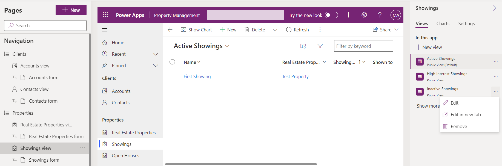

---
lab:
  title: 'ラボ 5:モデル駆動型アプリを構成する'
  module: 'Module 3: Configure forms, charts, and dashboards in model-driven apps'
---

# 演習ラボ 5 - モデル駆動型アプリを構成する

## シナリオ

このラボでは、モデル駆動型アプリを構成します。

## 学習する内容

- モデル駆動型アプリのナビゲーションを構成する方法
- モデル駆動型アプリでビューを制限する方法

## ラボ手順の概要

- ナビゲーションにグループを追加する
- ナビゲーションでテーブルを移動する
- アプリのビューを制限する
  
## 前提条件

- 以下を完了している必要があります: 「**ラボ 2: データ モデル**」、「**ラボ 3: モデル駆動型アプリを作成する**」、「**ラボ 4: フォームとビューを構成する**」

## 詳細な手順

## 演習 1 - モデル駆動型アプリを構成する

この演習では、モデル駆動型アプリのナビゲーションとテーブルを構成します。

### タスク 1.1 – グループを構成する

1. Power Apps Maker ポータル <https://make.powerapps.com> に移動します。

1. **Dev One** 環境にいることを確認します。

1. **ソリューション**を選択します。

1. **[物件一覧]** ソリューションを開きます。

1. 左側の **[オブジェクト]** ペインで、**[アプリ]** を選択します。

1. **プロパティ管理**アプリを選択し、**[コマンド]** メニュー (...) を選択し、**[編集]** > **[新しいタブで編集]** を選択します。

1. **ナビゲーション** ウィンドウで **[新しいグループ]** を選択します。

    

1. プロパティ ペインで、**[タイトル]** に「`Clients`」と入力します。

1. **[ナビゲーション]** を選択し、**コマンド** メニュー ([...]) を選択したあと、**[新しいグループ]** を選択します。

1. プロパティ ペインで、**[タイトル]** に「`Properties`」と入力します。

1. **ナビゲーション ウィンドウ**で、**[内覧] ビュー**を選択し、**[コマンド]** メニュー (...) を選択してから、**[下へ移動]** を選択します。

1. **ナビゲーション ウィンドウ**で、**[不動産物件] ビュー**を選択し、**[コマンド]** メニュー (...) を選択してから、**[下へ移動]** を選択します。

1. **ナビゲーション ウィンドウ**で **[オープン ハウス] ビュー**を選択し、**[コマンド]** メニュー (...) を選択してから、**[下へ移動]** を 3 回選択します。

    

### タスク 1.2 – ビューを制限する

1. **ナビゲーション ウィンドウ**で、**[内覧] ビュー**を選択します。

1. **[内覧]** ペインで、**[ビュー]** タブを選択します。

1. 右側のペインで **[非アクティブな内覧] ビュー**を選択し、**[コマンド]** メニュー (...) を選択してから、**[削除]** を選択します。

    

1. **保存と公開**を選択します。

1. アプリ デザイナーを**閉じて**、**[完了]** を選択します。
